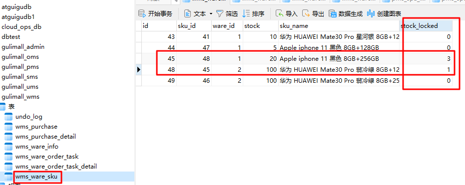

[toc]

# 一. 项目简介

演示视频：https://www.bilibili.com/video/BV1dwtfe9EDV

文档：https://gitlab.com/java1834509/java-notes/-/tree/main/谷粒商城

项目来源：https://www.bilibili.com/video/BV1np4y1C7Yf

# 二. 主要细节

详细文档：https://gitlab.com/java1834509/java-notes/-/tree/main/谷粒商城/高级篇/业务逻辑.md

## 1.  消息队列+最终一致性方案控分布式事务（高并发场景）

分布式事务要求大事务失败所有小事务一起回滚，但由于被调的远程服务无法感知调用服务执行成功与否，从而无法保证数据一致性。比如提交订单场景：下单时订单服务创建订单表、订单详情表，并远程调库存服务锁定库存（修改商品库存表），若订单服务发生异常，订单服务回滚而库存不回滚，即出现订单没了库存却未解锁的现象。常见的分布式事务解决方案有两阶段提交协议、TCC等，但为了应对高并发场景，一般采用MQ+最终一致性方案。


### 1.1 方案概述

总体设计：


order.delay.queue队列参数：

```java
@Bean
public Queue orderDelayQueue(){
    Map<String, Object> arguments=new HashMap<>();
    arguments.put("x-dead-letter-exchange","order-event-exchange");
    arguments.put("x-dead-letter-routing-key","order.release.order");
    arguments.put("x-message-ttl",60000); // 单位ms ，即1min
    Queue queue=new Queue("order.delay.queue", true,false,false,arguments);
    return queue;
}
```

stock.delay.queue队列参数：

```java
@Bean
public Queue stockDelayQueue(){
    Map<String, Object> arguments=new HashMap<>();
    arguments.put("x-dead-letter-exchange","stock-event-exchange");
    arguments.put("x-dead-letter-routing-key","stock.release");
    arguments.put("x-message-ttl",120000); // 2min
    Queue queue=new Queue("stock.delay.queue", true,false,false,arguments);
    return queue;
}
```


分布式事务常见问题及解决方案

**问题1：超时关单如何实现？**

答：下单成功后，订单服务往延时队列order.delay.queue中发消息OrderVo，延时队列设置30min过期，因此30min后消息会经order-event-exchange交换器到达队列order.release.order.queue，同时监听该队列里的OrderVo消息，收到消息后就触发handleOrderClose关单逻辑。


监听队列order.release.order.queue，关单：若订单此时还未支付就表明已超时，将订单状态由未支付更改为已关闭。关单出现任何异常都会将消息重新入队。


**问题2：下单时订单服务调库存服务远程锁库存成功，但后面业务出异常，订单回滚，库存不滚，如何让库存回滚？**


答：库存服务锁库存成功后，创建库存工作单（里面由订单号orderSn）和工作单详情(记录skuId、商品在哪个仓库锁了几件，以及工作单状态（锁定、已解锁、扣减），方便后续解锁)，并向stock.delay.queue延时队列里发消息（StockLockedVo：包括库存工作单id和工作单详情），由于stock.delay.queue设置了50min过期（订单30min自动过期关单，晚于订单关闭时间），因此50min后消息经过stock.event.exchange到达队列”stock.release.stock.queue“，库存解锁服务监听该队列，并消费类型为StockLockedVo的消息，进入库存解锁流程handleStockLockedRelease。


handleStockLockedRelease库存解锁逻辑：收到StockLockedVo消息后，根据库存详情单主键查对应的工作单详情

- 情况1：工作单详情在数据库中不存在，表明库存本身锁定失败，已经回滚，无需解锁
- 情况2：工作单详情在数据库中存在且状态为已锁定（其他状态无需解锁），此时更具订单情况判断是否需要解锁库存：
  - 订单表中没有该订单：表明库存锁定成功后订单服务自己出异常回滚了（比如上面int  i=10/0）, 此时需要解锁库存
  - 订单表中有对应的订单，且状态为已关闭（取消）： 对应超时关单或用户主动取消订单的场景，需要解锁库存；其他情况表明一切正常，无需解锁。

注意：

- 开启手动ACK，保证解锁成功才从队列移除消息；解锁库存发生异常再将消息重新入队。
- 解锁成功后将详情工作单状态置为已解锁，防止重复解锁


**问题3：远程服务假失败**

订单服务调库存服务锁库存成功后，由于网络原因，没有收到库存服务的反馈，或者接口超时导致订单服务认为调用远程服务失败，从而回滚订单，最终库存扣减了，订单却没了。


答：同上，库存扣减成功后就会向延时队列stock.delay.queue发消息（StockLockedVo），超过50min后抵达”stock.release.stock.queue“触发handleStockLockedRelease库存解锁逻辑：由于订单回滚，数据库中找不到对应的订单，若库存工作详情单若为锁定状态，就会进行解锁。


**问题4：若订单超时后，因机器卡顿（订单服务宕机）、消息积压等使关闭订单晚于库存解锁消息到达stock.release.stock.queue的时刻，数据库中订单为新建状态，此时库存无法解锁（且会将消息从stock.release.stock.queue队列里移除，之后即使订单服务关闭订单成功，库存也永久无法解锁。）**


答：加上以下逻辑：订单关闭成功后，订单服务再往stock.release.stock.queue发送消息告知订单已关闭，库存服务收到消息后立即解锁库存。


### 1.2 核心代码

订单服务：

（1）下单

```java
@Slf4j
@Service("orderService")
public class OrderServiceImpl extends ServiceImpl<OrderDao, OrderEntity> implements OrderService {
    private ThreadLocal<OrderSubmitVo> orderSubmitVoThreadLocal=new ThreadLocal<>();

    @Autowired
    MemberFeignService memberFeignService;
    @Autowired
    CartFeignService cartFeignService;
    @Autowired
    WareFeignService wareFeignService;
    @Autowired
    ProductFeignService productFeignService;
    @Autowired
    ThreadPoolExecutor threadPoolExecutor;
    @Autowired
    StringRedisTemplate stringRedisTemplate;
    @Autowired
    OrderItemService orderItemService;
    @Autowired
    RabbitTemplate rabbitTemplate;
   
    /**
     * @description: 提交订单（下单）
     **/
    
    //@GlobalTransactional
    @Transactional
    @Override
    public SubmitOrderRespVo submitOrder(OrderSubmitVo orderSubmitVo) {
        orderSubmitVoThreadLocal.set(orderSubmitVo);
        SubmitOrderRespVo submitOrderRespVo=new SubmitOrderRespVo();
        submitOrderRespVo.setCode(OrderSubmitErrorEnum.SUCCESS.getCode());
        MemberResponseVo member=LoginUserInterceptor.loginUser.get();
        // 1.验令牌【验证令牌和删令牌必须做成原子操作，防止并发出问题】
        // lua脚本: 执行后返回0失败  1成功
        String script="if redis.call('get', KEYS[1]) == ARGV[1] then return redis.call('del', KEYS[1]) else return 0 end";
        String orderToken=orderSubmitVo.getOrderToken(); //前端传来的令牌
        Long result=stringRedisTemplate.execute(new DefaultRedisScript<Long>(script,Long.class),
                Arrays.asList(OrderConstant.USER_ORDER_TOKEN_PREFIX+member.getId()),orderToken);
        if(result==0L){ // 令牌检验失败
            submitOrderRespVo.setCode(OrderSubmitErrorEnum.TOKEN_INVALID.getCode());
            return submitOrderRespVo;
        }else{ // 令牌校验成功
            // 2.创建订单、订单项等信息
            OrderCreateVo orderCreateVo=createOrder();
            // 3.验价
            BigDecimal payAmount=orderCreateVo.getOrder().getPayAmount();
            BigDecimal payPrice=orderSubmitVo.getPayPrice(); // 页面提交过来的应付金额
            if(Math.abs(payAmount.subtract(payPrice).doubleValue())<0.01){ // 对比成功
                // 4. 保存订单、订单项到数据库
                saveOrder(orderCreateVo);
                // 5. 远程锁定库存: 只要有异常，回滚订单数据
                WareSkuLockVo wareSkuLockVo=new WareSkuLockVo();
                wareSkuLockVo.setOrderSn(orderCreateVo.getOrder().getOrderSn());
                List<OrderItemVo> locks=orderCreateVo.getOrderItems().stream().map(orderItemEntity->{
                    OrderItemVo orderItemVo=new OrderItemVo();
                    orderItemVo.setSkuId(orderItemEntity.getSkuId());
                    orderItemVo.setTitle(orderItemEntity.getSkuName());
                    orderItemVo.setCount(orderItemEntity.getSkuQuantity());
                    return orderItemVo;
                }).collect(Collectors.toList());
                wareSkuLockVo.setLocks(locks);
                Result<Boolean> r=wareFeignService.orderLockStock(wareSkuLockVo);
                if(r.getCode()==0){ // 锁定成功
                    submitOrderRespVo.setOrder(orderCreateVo.getOrder());
                    // TODO 分布式事务：远程调用成功后发生异常 如何让远程事务
                    // int i=10/0;
                    // TODO 下单成功，发送消息给MQ（为了后面定时关单）
                    rabbitTemplate.convertAndSend("order-event-exchange","order.create.order",orderCreateVo.getOrder());
                    return submitOrderRespVo;
                }else{ // 锁定失败
                    log.error("远程调用gulimall-ware锁定库存失败");
                    submitOrderRespVo.setCode(OrderSubmitErrorEnum.STOCK_LOCK_FAIL.getCode());
                    throw new NoStockExecption();  // 不手动抛异常：库存锁定失败订单不回滚
                }
            }else{
                submitOrderRespVo.setCode(OrderSubmitErrorEnum.PRICE_CKECK_FAIL.getCode()); //验价失败
                log.error("检验订单价格失败，payAmount={}，payPrice={}",payAmount,payPrice);
                return submitOrderRespVo;
            }
        }
    }
    
    
    /**
     * @description: 关闭订单
     **/
    @Override
    public void closeOrder(OrderEntity order) {
        OrderEntity orderInDB=getBaseMapper().selectById(order.getId());
        if(orderInDB!=null&&orderInDB.getStatus()==OrderStatusEnum.NEW.getCode()){ // 订单在数据库里存在且状态为未支付（到队列已超时）
            // 更新状态
            OrderEntity update=new OrderEntity();
            update.setId(orderInDB.getId());
            update.setStatus(OrderStatusEnum.CLOSED.getCode());
            update.setModifyTime(new Date());
            updateById(update);
            // 消息积压、订单服务卡顿宕机等原因导致订单关闭消息未及时消费，
            // 库存解锁晚于订单关闭，订单状态是新建导致解锁库存失败，且消息被消费移除永久无法解锁库存
            // -->> 主动往"stock.release.stock.queue"发送消息订单已关闭，库存服务收到后立即解锁对应的库存
            OrderVo orderVo=new OrderVo();
            BeanUtils.copyProperties(orderInDB,orderVo);
            rabbitTemplate.convertAndSend("order-event-exchange","order.release.other",orderVo);
        }
    }
}
```


（2）超时关单：

```java
@Slf4j
@Service
@RabbitListener(queues = "order.release.order.queue") // 监听"order.release.order.queue"队列
public class OrderCloseListener {
    @Autowired
    OrderService orderService;
    @RabbitHandler
    public void handleOrderClose(OrderEntity order, Message message, Channel channel) throws IOException {
        log.info("收到定时关单消息:{}", JSON.toJSONString(order));
        try {
            orderService.closeOrder(order);
            channel.basicAck(message.getMessageProperties().getDeliveryTag(),false); // 关单成功，从队列移除消息
        }catch (Exception e){ // 关单出现异常，消息重新投放到消息队列
            channel.basicReject(message.getMessageProperties().getDeliveryTag(),true);
        }
    }
}
```


库存服务：

（1）锁定库存

```java
@Slf4j
@Service("wareSkuService")
public class WareSkuServiceImpl extends ServiceImpl<WareSkuDao, WareSkuEntity> implements WareSkuService {
    @Autowired
    WareSkuDao wareSkuDao;
    @Autowired
    ProductFeignService productFeignService;
    @Autowired
    RabbitTemplate rabbitTemplate;
    @Autowired
    WareOrderTaskService wareOrderTaskService;
    @Autowired
    WareOrderTaskDetailService wareOrderTaskDetailService;
    

    /**
     * @description: 为订单锁定库存：只要有一个商品锁定失败就回滚
     * Transactional 默认运行时异常就会回滚
     *
     * 分布式事务
     * 库存解锁场景：
     * 1、下的订单成功，超时未支付被系统自动取消、或者被用户手动取消
     * 2、下订单成功，库存锁定成功，接下来的业务调用失败 -> 整个大事务失败，订单回滚
     **/
    @Transactional(rollbackFor= NoStockExecption.class)
    @Override
    public Boolean orderLockStock(WareSkuLockVo wareSkuLockVo) {
        // 保存库存工作单： 追溯某件商品在哪个仓库锁了多少， 方便后续解锁
        WareOrderTaskEntity wareOrderTaskEntity=new WareOrderTaskEntity();
        wareOrderTaskEntity.setOrderSn(wareSkuLockVo.getOrderSn());
        wareOrderTaskEntity.setCreateTime(new Date());
        wareOrderTaskService.save(wareOrderTaskEntity);

        // 1.查出有库存的所有仓库id（实际是锁最近的仓库, 这里简化）
        List<OrderItemVo> locks=wareSkuLockVo.getLocks();
        if(locks!=null){
            List<SkuWareHasStock> skuWareHasStocks=locks.stream().map(orderItemVo -> {
                SkuWareHasStock stock=new SkuWareHasStock();
                stock.setSkuId(orderItemVo.getSkuId());
                stock.setNum(orderItemVo.getCount());
                List<Long> wareIds=wareSkuDao.listWareIdsHasStock(orderItemVo.getSkuId());
                stock.setWareIds(wareIds);
                return stock;
            }).collect(Collectors.toList());
            // 2. 锁定库存
            boolean lockedAll=true; // 是否全部锁成功（一个失败全部失败）
            for(SkuWareHasStock wareHasStock:skuWareHasStocks){
                boolean locked=false;
                List<Long> wardIds=wareHasStock.getWareIds();
                if(wardIds==null||wardIds.isEmpty()){ // 该商品没有库存
                    lockedAll=false;
                    throw new NoStockExecption(wareHasStock.getSkuId());
                }else{
                    // 每锁定成功一件sku，将StockLockedVo[库存工作单id,库存工作详情]发给MQ
                    for(Long wareId:wardIds){
                        Long count=wareSkuDao.lockSkuStock(wareHasStock.getSkuId(),wareId,wareHasStock.getNum());
                        if(count==1){ // 当前仓库锁定成功退出，锁定失败继续下一仓库
                            locked=true;
                            // TODO 告诉MQ sku库存锁定成功
                            // 保存库存工作单详情
                            WareOrderTaskDetailEntity wareOrderTaskDetailEntity=new WareOrderTaskDetailEntity();
                            wareOrderTaskDetailEntity.setWareId(wareId);
                            wareOrderTaskDetailEntity.setSkuId(wareHasStock.getSkuId());
                            wareOrderTaskDetailEntity.setSkuNum(wareHasStock.getNum());
                            wareOrderTaskDetailEntity.setLockStatus(LockStatusEnum.LOCKED.getCode()); // 置为已锁定
                            wareOrderTaskDetailEntity.setTaskId(wareOrderTaskEntity.getId());
                            wareOrderTaskDetailService.save(wareOrderTaskDetailEntity);

                            // 给MQ发消息: [库存工作单id,库存工作详情]
                            StockLockedVo stockLockedVo=new StockLockedVo();
                            stockLockedVo.setId(wareOrderTaskEntity.getId());
                            StockLockedDetailVo stockLockedDetailVo=new StockLockedDetailVo();
                            BeanUtils.copyProperties(wareOrderTaskDetailEntity,stockLockedDetailVo);
                            stockLockedVo.setDetail(stockLockedDetailVo);
                            rabbitTemplate.convertAndSend(WareConstant.STOCK_EVENT_EXCHANGE,WareConstant.STOCK_LOCKED_ROUTING_KEY,stockLockedVo);
                            break;
                        }
                    }
                    if(!locked){ // 只要一个商品锁定失败就整体失败
                        lockedAll=false;
                        throw new NoStockExecption(wareHasStock.getSkuId());
                    }
                }
            }
        }
        // 所有商品都锁定成功
        return true;
    }
}
```

(2) 解锁库存

```java
@Slf4j
@Service
@RabbitListener(queues = WareConstant.STOCK_RELEASE_STOCK_QUEUE) // 监听"stock.release.stock.queue"队列
public class StockReleaseListener {
    @Autowired
    WareOrderTaskService wareOrderTaskService;
    @Autowired
    WareOrderTaskDetailService wareOrderTaskDetailService;
    @Autowired
    OrderFeignService orderFeignService;
    @Autowired
    WareSkuDao wareSkuDao;

    /**
     * @description: 监听队列：解锁库存
     * 注意：解锁库存失败不要删消息，需要重新解锁 （手动ACK）
     **/
    @RabbitHandler
    public void handleStockLockedRelease(StockLockedVo stockLockedVo, Message message, Channel channel) throws IOException {
        log.info("收到解锁库存的消息:{}", JSON.toJSONString(stockLockedVo));
        Long id=stockLockedVo.getId(); // 库存工作单id
        Long detailId=stockLockedVo.getDetail().getId(); // 库存工作单详情Id

        /**
         * 情况1： detailId在数据库wms_ware_order_task_detail表中不存在：库存本身锁定失败，自己回滚，无需解锁
         **/

        /**
         * 情况2： detailId在数据库wms_ware_order_task_detail表中存在,且状态为已锁定（解锁过的不重复解锁）：库存本身锁定成功，此时需要根据订单情况判断是否需要解锁
         *      1) oms_order表中无该订单： 订单出问题自己回滚了，要解锁库存
         *      2) oms_order表中有该订单： 订单状态为已取消，要解锁库存；其他情况表明一切正常，无需解锁。
         **/
        WareOrderTaskDetailEntity wareOrderTaskDetailEntity=wareOrderTaskDetailService.getById(detailId);
        if(wareOrderTaskDetailEntity!=null&&wareOrderTaskDetailEntity.getLockStatus()==LockStatusEnum.LOCKED.getCode()){
            WareOrderTaskEntity wareOrderTaskEntity=wareOrderTaskService.getById(id);
            String orderSn=wareOrderTaskEntity.getOrderSn();
            Result<OrderVo> r= orderFeignService.getOrderStatus(orderSn);
            if(r.getCode()==0){
                OrderVo orderVo=r.getData();
                // oms_order表中无该订单或订单状态为已关闭(取消)  -> 解锁库存
                if(orderVo==null||orderVo.getStatus()==OrderStatusEnum.CLOSED.getCode()){
                    unLockStock(wareOrderTaskDetailEntity.getSkuId(),wareOrderTaskDetailEntity.getWareId(),wareOrderTaskDetailEntity.getSkuNum(),detailId);
                    channel.basicAck(message.getMessageProperties().getDeliveryTag(),false); // 手动ACK：解锁库存失败不会删消息
                }
            }else{
                channel.basicReject(message.getMessageProperties().getDeliveryTag(),true); //拒绝并将消息重新投放到队列
                log.error("远程查询订单状态失败,orderSn={}",orderSn);
            }
        }else{ // 无需解锁：直接把消息删掉
            channel.basicAck(message.getMessageProperties().getDeliveryTag(),false);
        }
    }

    /**
     * @description: 防止订单服务卡顿（宕机）、消息积压等原因，
     * 库存解锁消息处理早于订单关闭（此时订单为新建状态，库存服务收到消息后啥也不做就走了，
     * 由于库存解锁消息被移除，后面即使订单关闭成功，库存也永远无法解锁）
     *     此处监听订单关闭后发来的消息（消息服务关单后主动发）
     * @param orderVo 同orderEntity
     * @param message
     * @param channel
     **/
    @RabbitHandler
    public void handleOrderCloseRelease(OrderVo orderVo,Message message, Channel channel) throws IOException {
        log.info("收到订单关闭消息,准备解锁库存:{}",JSON.toJSONString(orderVo));
        try {
            String orderSn=orderVo.getOrderSn();
            // 根据订单号查库存工作单
            WareOrderTaskEntity wareOrderTaskEntity=wareOrderTaskService.getOrderTaskByOrderSn(orderSn);
            // 查库存工作单详情，找到未解锁的 ，防止重复解锁
            List<WareOrderTaskDetailEntity> unlocked =wareOrderTaskDetailService.list(new QueryWrapper<WareOrderTaskDetailEntity>().eq("task_id",wareOrderTaskEntity.getId()).eq("lock_status",LockStatusEnum.LOCKED.getCode()));
            unLockStockBatch(unlocked);   // 幂等：不用担心消重复发，只解锁库存工作单状态为锁定的库存（解锁后就将状态改为已解锁，后续无需解锁）
            channel.basicAck(message.getMessageProperties().getDeliveryTag(),false);  // 解锁成功从队列移除
        }catch (Exception e){
            channel.basicReject(message.getMessageProperties().getDeliveryTag(),true); //解锁出现异常将消息重新投放到队列
        }
    }

    @Transactional  // 批量解锁库存： 任一解锁失败 回滚
    public void unLockStockBatch(List<WareOrderTaskDetailEntity> unlocked){
        if(unlocked!=null&&!unlocked.isEmpty()){
            for(WareOrderTaskDetailEntity entity:unlocked){
                unLockStock(entity.getSkuId(),entity.getWareId(),entity.getSkuNum(),entity.getId());
            }
        }
    }

    /**
     * @description: 解锁库存
     * @param skuId
     * @param wareId 仓库id
     * @param num 解锁数量
     * @param detailId 库存工作详情单id
     **/
    private void unLockStock(Long skuId,Long wareId,Integer num,Long detailId){
        wareSkuDao.unLockStock(skuId,wareId,num);

        // 更新库存工作详情单的状态
        WareOrderTaskDetailEntity wareOrderTaskDetailEntity=new WareOrderTaskDetailEntity();
        wareOrderTaskDetailEntity.setId(detailId);
        wareOrderTaskDetailEntity.setLockStatus(LockStatusEnum.UNLOCKED.getCode()); // 变为已解锁
        wareOrderTaskDetailService.updateById(wareOrderTaskDetailEntity);
    }
}
```


### 1.3 测试

#### 1.3.1 创建的交换机和队列


#### 1.3.2 测试超时自动关单，同时解锁库存（问题1）

提交如下订单：


超时未支付：测试设置订单延时队列1min过期，库存延时队列2min过期。前端支付页显示的时间不用管，还没开发支付功能，只是静态页面。


- 创建订单之初

订单延时队列和库存延时队列都有消息，由于每锁定一项商品库存就发一条消息给库存延时队列，买了两项商品，因此是2条。


订单状态为待支付


库存工作单详情锁定状态为：已锁定


库存锁定情况：锁了3件iphone11 和1件华为mate30




- 1min后

订单过期，order.release.order.queue队列收到关闭订单消息，触发handleOrderClose关单逻辑:  将订单状态变为已关闭，同时向stock.release.stock.queue队列发送消息要求解锁库存，库存服务收到消息后触发解锁库存逻辑handleOrderCloseRelease


订单状态变为已关闭


工作单详情状态变为已解锁：


锁定数量回滚：


- 2min后

stock.delay.queue队列里的消息过期并抵达stock.release.stock.queue，触发库存解锁逻辑handleStockLockedRelease：但由于库存工作单状态为已解锁，不再重复解锁。队列中消息全部被消费移除。


#### 1.3.3 测试远程服务（锁库存）调用成功后发生异常，远程服务能否回滚（问题2）

打开异常代码：int i=10/0； 模拟订单服务调用库存服务锁库存成功后发生异常，观察库存能否解锁


- 提交订单伊始


订单服务发生异常订单自动回滚，数据库没有对应的订单：


锁定库存成功，往库存延时队列中发消息StockLockedVo，买了两项商品（2条消息）


数据库锁定库存成功：


- 2min后

收到解锁库存的消息，触发库存解锁逻辑handleStockLockedRelease：


库存解锁成功：


消息被消费移除：


#### 1.3.4 测试远程服务假异常（问题3）

类似7.4.8.3.3

#### 1.3.5 测试关单晚于库存解锁消息到达时间（问题4）

将订单过期时间设为2min，库存过期时间设为1min，模拟关单晚于库存解锁消息到达时间。

类似问题1，1min时库存消息先到stock.release.stock.queue，触发handleStockLockedRelease库存解锁逻辑，但由于此时订单存在且状态为待付款，因此不会解锁，且消息被消费移除；等到2min时，订单过期，将订单状态改为已关闭，并向stock.release.stock.queue发送消息，要求解锁库存，库存服务监听收到该消息后触发handleOrderCloseRelease库存解锁逻辑，此时库存解锁成功。


## 2. Redis+分布式锁优化分类数据查询

将三级分类数据存入redis，redis中有直接返回，没有才查数据库并写入redis。


同时加分布式锁限制只有一个线程查询数据库，减轻数据库访问压力：


AOP更新缓存：改了数据库中的分类数据就删除缓存，保持缓存和数据库的一致性。


## 3. ElasticSearch 商品检索

实现思路：首先确定存入ES的数据模型，在商品上架时将数据存入ES，供后续检索。

### 3.1 ES中的数据模型

明确需求，前端传来的可能检索条件：

- 检索关键字
- 三级分类Id
- 排序条件：销量、价格、热度
- 其他过滤条件：是否有货、商品价格区间、品牌、分类、属性值


综上确定商品上架时存入ES的数据模型：

```java
/**
* @Description sku上架在ES里保存的数据模型
**/
@Data
public class SkuEsModel {
    /**
     * sku Id
     **/
    private Long skuId;
    /**
     * 所属spu Id
     **/
    private Long spuId;
    /**
     * 商品标题
     **/
    private String skuTitle;
    /**
     * 商品价格
     **/
    private BigDecimal skuPrice;
    /**
     * sku图片集
     **/
    private String skuImg;
    /**
     * sku 销量
     **/
    private Long saleCount;
    /**
     * 是否有库存
     **/
    private Boolean hasStock;
    /**
     * 热度评分
     **/
    private Long hotScore;
    /**
     * 品牌Id
     **/
    private Long brandId;
    /**
     * 分类Id
     **/
    private Long catalogId;
    /**
     * 分类名
     **/
    private String catalogName;
    /**
     * 品牌名
     **/
    private String brandName;
    /**
     * 品牌图片
     **/
    private String brandImg;
    /**
     * 分类图片
     **/
    private String catalogImg;
    private List<Attr> attrs;
    @Data
    public static class Attr{
        /**
         * 属性id
         */
        private Long attrId;
        /**
         * 属性名
         */
        private String attrName;
        /**
         * 属性值
         */
        private String attrValue;
    }
}
```


### 3.2 商品上架（gulimall-product）

调gulimall-search服务将数据写入ES方便检索，同时更改spu上架状态。

com.atguigu.product.service.impl.SpuInfoServiceImpl#up

```java
 	@Override
    public void up(Long spuId) {
        
        // 1.查询当前sku所有用来检索的规格属性-共一个spu
        List<ProductAttrValueEntity> productAttrValueEntities=productAttrValueService.getSearchAttrs(spuId);
        List<SkuEsModel.Attr> searchAttrs=productAttrValueEntities.stream().map(productAttrValueEntity -> {
            SkuEsModel.Attr attr=new SkuEsModel.Attr();
            BeanUtils.copyProperties(productAttrValueEntity,attr);
            return attr;
        }).collect(Collectors.toList());

        // 2.查出当前spuId对应的所有sku
        List<SkuInfoEntity> skus=skuInfoDao.selectList(new QueryWrapper<SkuInfoEntity>().eq("spu_id",spuId));
        List<Long> skuIds=new ArrayList<>();
        if(skus!=null){
            skuIds=skus.stream().map(SkuInfoEntity::getSkuId).collect(Collectors.toList());
        }

        Map<Long,Boolean> stockMap=null;
        try {
            // 3.远程调用库存系统查出是否有库存
            Result<List<SkuHasStockVo>> hasStock=wareFeignService.getSkuHasStock(skuIds);
            stockMap=hasStock.getData().stream().collect(Collectors.toMap(SkuHasStockVo::getSkuId,SkuHasStockVo::getHasStock));
        }catch (Exception e){
            log.error("远程调用库存服务出现异常，异常原因：{}",e);
        }
        Map<Long, Boolean> finalStockMap = stockMap;
       
        // 4.组装数据
        List<SkuEsModel> skuEsModels=skus.stream().map(sku->{
            SkuEsModel skuEsModel=new SkuEsModel();
            BeanUtils.copyProperties(sku,skuEsModel);
            // skuPrice ,skuImg
            skuEsModel.setSkuPrice(sku.getPrice());
            skuEsModel.setSkuImg(sku.getSkuDefaultImg());
            // hasStock , hotScore
            if(finalStockMap ==null){
                // TODO 后面再处理
                skuEsModel.setHasStock(true); // 调用远程服务出现异常直接置为有库存
            }else{
                skuEsModel.setHasStock(finalStockMap.get(sku.getSkuId()));
            }

            // 热度评分， 初始置0
            skuEsModel.setHotScore(0L);

            // 查询品牌和分类的信息
            BrandEntity brandEntity=brandDao.selectById(sku.getBrandId());
            if(brandEntity!=null){
                skuEsModel.setBrandName(brandEntity.getName());
                skuEsModel.setBrandImg(brandEntity.getLogo());
            }
            CategoryEntity category=categoryDao.selectById(sku.getCatalogId());
            if(category!=null){
                skuEsModel.setCatalogName(category.getName());
            }
            // 设置检索属性
            skuEsModel.setAttrs(searchAttrs);
            return skuEsModel;
        }).collect(Collectors.toList());
        
        // 5. 将数据发送给gulimall-search服务并保存到ES
        Result result=searchFeignService.productStartUp(skuEsModels);
        
        if(result.getCode()==0){ // 远程调用成功
            // 6. 修改spu发布状态
            SpuInfoEntity spuInfoEntity=new SpuInfoEntity();
            spuInfoEntity.setId(spuId);
            spuInfoEntity.setPublishStatus(PublishStatusEnum.UP.getCode());
            spuInfoEntity.setUpdateTime(new Date());
            getBaseMapper().updateById(spuInfoEntity);
        }else{
            // 远程调用失败
            // TODO 重复调用？ 接口幂等性 重试机制
        }
    }
```


gulimall-search服务将gulimall-product传来的数据保存到ES：

```java
@Slf4j
@Service
public class ProductSaveServiceImpl implements ProductSaveService {
    @Autowired
    RestHighLevelClient restHighLevelClient;

    /**
     * 主程序启动默认执行：创建索引及映射
     **/
    //@PostConstruct
    public void createIndexAndMapping() throws IOException {
        // 1.给es中建立索引: product,并建立映射关系 gulimall-search/src/main/resources/product-mapping.txt
        // 注意CreateIndexRequest导包，需为org.elasticsearch.client.indices.CreateIndexRequest;否则报错
        org.elasticsearch.client.indices.CreateIndexRequest request = new CreateIndexRequest(EsContant.PRODUCT_INDEX);
        request.mapping("{\n" +
                "    \"properties\": {\n" +
                "      \"skuId\": {\n" +
                "        \"type\": \"long\"\n" +
                "      },\n" +
                "      \"spuId\": {\n" +
                "        \"type\": \"keyword\"\n" +
                "      },\n" +
                "      \"skuTitle\": {\n" +
                "        \"type\": \"text\",\n" +
                "        \"analyzer\": \"ik_smart\"\n" +
                "      },\n" +
                "      \"skuPrice\": {\n" +
                "        \"type\": \"keyword\"\n" +
                "      },\n" +
                "      \"skuImg\": {\n" +
                "        \"type\": \"keyword\"\n" +
                "      },\n" +
                "      \"saleCount\": {\n" +
                "        \"type\": \"long\"\n" +
                "      },\n" +
                "      \"hasStock\": {\n" +
                "        \"type\": \"boolean\"\n" +
                "      },\n" +
                "      \"hotScore\": {\n" +
                "        \"type\": \"long\"\n" +
                "      },\n" +
                "      \"brandId\": {\n" +
                "        \"type\": \"long\"\n" +
                "      },\n" +
                "      \"catalogId\": {\n" +
                "        \"type\": \"long\"\n" +
                "      },\n" +
                "      \"brandName\": {\n" +
                "        \"type\": \"keyword\"\n" +
                "      },\n" +
                "      \"brandImg\": {\n" +
                "        \"type\": \"keyword\"\n" +
                "      },\n" +
                "      \"catalogName\": {\n" +
                "        \"type\": \"keyword\"\n" +
                "      },\n" +
                "      \"attrs\": {\n" +
                "        \"type\": \"nested\",\n" +
                "        \"properties\": {\n" +
                "          \"attrId\": {\n" +
                "            \"type\": \"long\"\n" +
                "          },\n" +
                "          \"attrName\": {\n" +
                "            \"type\": \"keyword\"\n" +
                "          },\n" +
                "          \"attrValue\": {\n" +
                "            \"type\": \"keyword\"\n" +
                "          }\n" +
                "        }\n" +
                "      }\n" +
                "    }\n" +
                "  }",XContentType.JSON);
        try {
            restHighLevelClient.indices().create(request, RequestOptions.DEFAULT);
        }catch (Exception e){
            log.error("ES初始化创建失败，mapping已存在请先删除: 发送请求 DELETE /{}",EsContant.PRODUCT_INDEX);
        }
    }
    @Override
    public boolean productStartUp(List<SkuEsModel> skuEsModels) throws IOException {
        // 保存到ES
        // 1.给es中建立索引（createIndexAndMapping方法）: product,并建立映射关系 gulimall-search/src/main/resources/product-mapping.txt
        createIndexAndMapping();
        // 2.构造批量请求
        BulkRequest bulkRequest=new BulkRequest();
        for(SkuEsModel skuEsModel:skuEsModels){
            IndexRequest indexRequest=new IndexRequest(EsContant.PRODUCT_INDEX); // 指定索引

            indexRequest.id(skuEsModel.getSkuId().toString()); // Document id设为skuId,防止不断添加数据，skuId相同则覆盖
            String s= JSON.toJSONString(skuEsModel);
            indexRequest.source(s, XContentType.JSON);
            bulkRequest.add(indexRequest);
        }

        // 2. 保存到ES 批量保存
        BulkResponse bulkResponse =restHighLevelClient.bulk(bulkRequest, ElasticSearchConfig.COMMON_OPTIONS);
        // TODO 3.上架出错处理 先用日志简单记录
        boolean error=bulkResponse.hasFailures();
        if (error){
            List<String> collect=Arrays.stream(bulkResponse.getItems()).map(BulkItemResponse::getId).collect(Collectors.toList());
            log.error("商品上架错误:{}",collect);
        }
        return !error;
    }
}
```


SPU上架完成后：发GET请求可以从ES中查到索引为product下的数据，即保存成功。


### 3.3 商品检索

#### 3.3.1 编写DSL查询语句

总体分为：

- 查询：query
- 排序：sort
- 分页： from ,size
- 高亮：hightlight
- 聚合：aggs


##### 3.3.1.1 查询

query:   按照商品标题、分类、品牌Id集合、属性集合、是否有库存、价格区间进行组装

##### 3.3.1.2 排序

sort: 销量、价格区间、热度 。ASC/DESC

##### 3.3.1.3 分页

##### 3.3.1.4 高亮

highlight： 对检索的skuTitle进行高亮显示

##### 3.2.2.5 聚合

aggs: 对ES中命中的数据进行汇总分析。

- brand_agg: 根据品牌ID进行聚合，需要获取品牌ID、品牌名、品牌Logo
- catalog_agg: 根据分类ID进行聚合，需要获取分类ID、分类名
- attr_agg： 根据属性进行聚合，需要获取属性ID、属性名、属性值


DSL语句如下：

```java
{
   //  1. query条件组装
  "query": {
    "bool": {
      "must": [
        {
          "match": {
            "skuTitle": "华为"  // 按照商品标题
          }
        }
      ],
      "filter": [
        {
          "term": {
            "catalogId": "225"  // 按照分类
          }
        },
        {
          "terms": {
            "brandId": [   // 按照品牌Id集合
              "9",
              "12"
            ]
          }
        },
        {               // 按照属性集合（attrs字段对应一个java类，ES中要用nested类型）
          "nested": {
            "path": "attrs",   
            "query": {
              "bool": {
                "must": [
                  {
                    "term": {
                      "attrs.attrId": {
                        "value": "15"
                      }
                    }
                  },
                  {
                    "terms": {
                      "attrs.attrValue": [
                        "HUAWEI Kirin 980",
                        "海思（Hisilicon）"
                      ]
                    }
                  }
                ]
              }
            }
          }
        },
        {
          "term": {
            "hasStock": "true"    // 按照是否有库存
          }
        },
        {
          "range": {
            "skuPrice": {        // 按照价格区间
              "gte": 5000,
              "lte": 8000
            }
          }
        }
      ]
    }
  },
    
    //  2. sort条件组装
  "sort": [                    // 排序
    {
      "skuPrice": {
        "order": "desc"
      }
    }
  ],
    //  3. 分页条件组装
  "from": 0,
  "size": 1,
     //  4. 高亮
  "highlight": {
    "fields": {
      "skuTitle": {
        
      }
    },
    "pre_tags": "<b style='color:red'>",
    "post_tags": "</b>"
  },
    
     //  5. 聚合
  "aggs": {
    "brand_agg": {
      "terms": {
        "field": "brandId",  // 5.1 根据品牌ID聚合
        "size": 10
      },
      "aggs": {
        "brand_name_agg": {  // 获取品牌名-子聚合（基于上一次聚合数据）
          "terms": {
            "field": "brandName",
            "size": 10
          }
        },
        "brand_img_agg": {  // 获取品牌logo-子聚合
          "terms": {
            "field": "brandImg",
            "size": 10
          }
        }
      }
    },
    "catalog_agg": {   // 5.2 根据分类ID聚合
      "terms": {
        "field": "catalogId",
        "size": 10
      },
      "aggs": {
        "catalog_name_agg": { 
          "terms": {
            "field": "catalogName",  // 分类名
            "size": 10
          }
        }
      }
    },
    "attr_agg": {  // 5.2 根据属性聚合（nested）
      "nested": {
        "path": "attrs"
      },
      "aggs": {
        "attr_id__agg": {
          "terms": {
            "field": "attrs.attrId", // 属性Id
            "size": 10
          },
          "aggs": {
            "attr_name_agg": {
              "terms": {
                "field": "attrs.attrName", // 属性名
                "size": 10
              }
            },
            "attr_value_agg": {
              "terms": {
                "field": "attrs.attrValue", // 属性Id
                "size": 10
              }
            }
          }
        }
      }
    }
  }
}
```

#### 3.3.2 将DSL结构和检索条件转化为Java代码

根据前端传来的条件拼接DSL语句从ES中查询命中的记录，包装返回给前端。

```java
@Slf4j
@Service
public class MallSearchServiceImpl implements MallSearchService {
    @Autowired
    private RestHighLevelClient restHighLevelClient;
    @Autowired
    ProductFeignService productFeignService;
    @Override
    public SearchResult search(SearchParam searchParam) throws IOException {
        // 去ES中查询
        SearchResult searchResult=null;
        // 1.构造DSL查询条件 ，根据 gulimall-search/src/main/resources/DSL.json
        SearchRequest searchRequest=buildSearchRequest(searchParam);
        try{
            // 2.执行检索请求
            SearchResponse searchResponse=restHighLevelClient.search(searchRequest, ElasticSearchConfig.COMMON_OPTIONS);
            // 3. 分析响应数据并封装成所需格式
            searchResult=buildSearchResult(searchResponse,searchParam);
        }catch (Exception e){
            log.error("从ES中检索数据发生异常,searchParam:{},Exception:{}",JSON.toJSONString(searchParam),JSON.toJSONString(e));
        }
        return searchResult;
    }

    /**
     * @description: 构建检索请求
     **/
    private SearchRequest buildSearchRequest(SearchParam searchParam) {
        /**
         * 1.构建DSL语句
         **/
        SearchSourceBuilder searchSourceBuilder=new SearchSourceBuilder();
        /**
         *  1.1 模糊匹配，过滤（按属性、分类、品牌、价格区间、库存）
         **/

        // 1.1.1 构建bool-query
        // must-模糊匹配
        BoolQueryBuilder boolQueryBuilder= QueryBuilders.boolQuery();
        if(searchParam!=null&&!StringUtils.isEmpty(searchParam.getKeyword())){
            boolQueryBuilder.must(QueryBuilders.matchQuery("skuTitle",searchParam.getKeyword()));
        }

        // 1.1.2 bool -filter  按三级分类ID查
        if(searchParam.getCatalog3Id()!=null){
            boolQueryBuilder.filter(QueryBuilders.termQuery("catalogId",searchParam.getCatalog3Id()));
        }

        // 1.1.2 bool -filter  按品牌ID列表查
        if(searchParam.getBrandId()!=null&&!searchParam.getBrandId().isEmpty()){
            boolQueryBuilder.filter(QueryBuilders.termsQuery("brandId",searchParam.getBrandId()));
        }

        // 1.1.3 bool -filter  按所有指定的属性查
        if(searchParam.getAttrs()!=null&&!searchParam.getAttrs().isEmpty()){
            // attrs=1_5寸:8寸&attrs=2_16G:8G
            for (String attrStr:searchParam.getAttrs()){
                BoolQueryBuilder nestboolQueryBuilder=QueryBuilders.boolQuery();
                String[] s=attrStr.split("_");
                String attrId=s[0]; //检索用的属性Id
                String[] attrValue=s[1].split(":"); // 该属性用的值
                nestboolQueryBuilder.must(QueryBuilders.termQuery("attrs.attrId",attrId));
                nestboolQueryBuilder.must(QueryBuilders.termsQuery("attrs.attrValue",attrValue));
                // 每个属性都要加入外部大boolQueryBuilder
                //嵌入式Query  ScoreMode.None不参与评分
                NestedQueryBuilder nestedQueryBuilder =QueryBuilders.nestedQuery("attrs",nestboolQueryBuilder, ScoreMode.None);
                boolQueryBuilder.filter(nestedQueryBuilder);
            }
        }

        // 1.1.4 bool -filter  按是否有库存查
        if(searchParam.getHasStock()!=null){
            boolQueryBuilder.filter(QueryBuilders.termQuery("hasStock",searchParam.getHasStock()==1));
        }

        // 1.1.5 bool -filter  按价格区间查
        if(searchParam.getSkuPrice()!=null&&!StringUtils.isEmpty(searchParam.getSkuPrice())){
            /** 1_500/_500/500_
             * "range": {
             *             "skuPrice": {
             *               "gte": 5000,
             *               "lte": 8000
             *             }
             *           }
             **/
            RangeQueryBuilder rangeQueryBuilder= QueryBuilders.rangeQuery("skuPrice");
            String[] s=searchParam.getSkuPrice().split("_");
            if(searchParam.getSkuPrice().startsWith("_")){ // 小于等于
                rangeQueryBuilder.lte(s[0]);
            }else if(searchParam.getSkuPrice().endsWith("_")){  // 大于等于
                rangeQueryBuilder.gte(s[0]);
            }else{ // 区间
                rangeQueryBuilder.gte(s[0]).lte(s[1]);
            }
            boolQueryBuilder.filter(rangeQueryBuilder);
        }

        // 整个大boolQueryBuilder放入searchSourceBuilder
        searchSourceBuilder.query(boolQueryBuilder);

        /**
         * 1.2 排序 分页 高亮
         **/

        /**
         * 1.2.1 排序
         *
         *      * 排序条件
         *      * sort=saleCount_asc/desc  销量
         *      * sort=skuPrice_asc/desc   价格
         *      * sort=hotScore_asc/desc   热度
         *
         **/
        if(searchParam.getSort()!=null&&!StringUtils.isEmpty(searchParam.getSort())){
            String sort=searchParam.getSort();
            String[] s=sort.split("_");
            SortOrder order=s[1].equalsIgnoreCase("asc")?SortOrder.ASC:SortOrder.DESC;
            searchSourceBuilder.sort(s[0], order);
        }

        /**
         * 1.2.2 分页
         * pageNum:1  from=0 pageSize:5  [0,1,2,3,4]
         * pageNum:2  from=5 pageSize:5  [5,6,7,8,9]
         **/
        searchSourceBuilder.from((searchParam.getPageNum()-1)*EsContant.PRODUCT_PAGE_SIZE);
        searchSourceBuilder.size(EsContant.PRODUCT_PAGE_SIZE);

        /**1.2.3 高亮
         **/
        if(searchParam.getKeyword()!=null&&!StringUtils.isEmpty(searchParam.getKeyword())){
            HighlightBuilder highlightBuilder=new HighlightBuilder();
            highlightBuilder.field("skuTitle");
            highlightBuilder.preTags("<b style='color:red'>");
            highlightBuilder.postTags("</b>");
            searchSourceBuilder.highlighter(highlightBuilder);

        }


        /**
         * 1.3 聚合分析
         **/
        // 1.3.1 品牌聚合
        TermsAggregationBuilder brandAgg= AggregationBuilders.terms("brand_agg").field("brandId").size(50);
        // 品牌聚合的子聚合
        brandAgg.subAggregation(AggregationBuilders.terms("brand_name_agg").field("brandName").size(1));
        brandAgg.subAggregation(AggregationBuilders.terms("brand_img_agg").field("brandImg").size(1));
        searchSourceBuilder.aggregation(brandAgg);

        // 1.3.2 分类聚合
        TermsAggregationBuilder catalogAgg= AggregationBuilders.terms("catalog_agg").field("catalogId").size(20);
        // 分类聚合的子聚合
        catalogAgg.subAggregation(AggregationBuilders.terms("catalog_name_agg").field("catalogName").size(1));
        searchSourceBuilder.aggregation(catalogAgg);

        // 1.3.3 属性聚合
        NestedAggregationBuilder attrAgg= AggregationBuilders.nested("attr_agg","attrs");
        TermsAggregationBuilder attrIdAgg=AggregationBuilders.terms("attr_id_agg").field("attrs.attrId");
        attrIdAgg.subAggregation(AggregationBuilders.terms("attr_name_agg").field("attrs.attrName").size(1));
        attrIdAgg.subAggregation(AggregationBuilders.terms("attr_value_agg").field("attrs.attrValue").size(50));
        attrAgg.subAggregation(attrIdAgg);
        searchSourceBuilder.aggregation(attrAgg);
        // 测试：验证代码正确定，放到kibina中执行
        log.info("构建的DSL：{}",searchSourceBuilder);
        SearchRequest searchRequest=new SearchRequest(new String[]{EsContant.PRODUCT_INDEX},searchSourceBuilder);
        return searchRequest;
    }

    /**
     * @description: 封装结果数据
     * @param:
     * @param searchResponse
     * @return: com.atguigu.search.vo.SearchResult
     **/
    private SearchResult buildSearchResult(SearchResponse searchResponse,SearchParam searchParam) {
        SearchResult result=new SearchResult();
        /**
         * 1. 所有查询到的商品信息
         **/
        SearchHits hits=searchResponse.getHits(); //获取查询命中的所有数据
        List<SkuEsModel> skuEsModels=new ArrayList<>();
        if(hits!=null&&hits.getHits().length>0){
            for(SearchHit hit: hits.getHits()){
                String sourceAsString=hit.getSourceAsString();
                SkuEsModel skuEsModel= JSON.parseObject(sourceAsString,SkuEsModel.class);
                // 设置高亮
                if(searchParam.getKeyword()!=null&&!StringUtils.isEmpty(searchParam.getKeyword())){
                    HighlightField skuTitle=hit.getHighlightFields().get("skuTitle");
                    String  s=skuTitle.getFragments()[0].string();
                    skuEsModel.setSkuTitle(s);
                }
                skuEsModels.add(skuEsModel);
            }
        }
        result.setProducts(skuEsModels);
        /**
         * 2. 所有查询到的商品涉及的属性信息
         **/
        List<SearchResult.AttrVo> attrVos=new ArrayList<>();
        ParsedNested attAgg=searchResponse.getAggregations().get("attr_agg");
        ParsedLongTerms attrIdAgg=attAgg.getAggregations().get("attr_id_agg");
        for(Terms.Bucket bucket:attrIdAgg.getBuckets()){
            SearchResult.AttrVo  attrVo=new SearchResult.AttrVo();
            // 属性Id
            long attrId=bucket.getKeyAsNumber().longValue();
            // 属性名
            String attrName=((ParsedStringTerms)bucket.getAggregations().get("attr_name_agg")).getBuckets().get(0).getKeyAsString();
            // 属性值
            List<String> attrValues=((ParsedStringTerms)bucket.getAggregations().get("attr_value_agg")).getBuckets().stream().map(item -> {
                return ((Terms.Bucket)item).getKeyAsString();
            }).collect(Collectors.toList());
            attrVo.setAttrId(attrId);
            attrVo.setAttrName(attrName);
            attrVo.setAttrValue(attrValues);
            attrVos.add(attrVo);
        }
        result.setAttrs(attrVos);


        /**
         * 3. 所有涉及到的品牌信息
         **/
        ParsedLongTerms brandAgg=searchResponse.getAggregations().get("brand_agg");
        List<SearchResult.BrandVo> brandVos=new ArrayList<>();
        List<? extends Terms.Bucket> brandBuckets=brandAgg.getBuckets();
        for(Terms.Bucket bucket: brandBuckets){
            SearchResult.BrandVo brandVo=new SearchResult.BrandVo();
            // 品牌ID
            String keyAsString=bucket.getKeyAsString();
            brandVo.setBrandId(Long.parseLong(keyAsString));
            // 拿到品牌名
            ParsedStringTerms brandNameAgg=bucket.getAggregations().get("brand_name_agg");
            brandVo.setBrandName(brandNameAgg.getBuckets().get(0).getKeyAsString());
            // 拿到品牌图片
            ParsedStringTerms brandImgAgg=bucket.getAggregations().get("brand_img_agg");
            brandVo.setBrandImg(brandImgAgg.getBuckets().get(0).getKeyAsString());
            brandVos.add(brandVo);
        }
        result.setBrands(brandVos);

        /**
         * 4. 所有涉及到的分类信息
         **/
        ParsedLongTerms catalogAgg=searchResponse.getAggregations().get("catalog_agg");
        List<SearchResult.CatalogVo> catalogVos=new ArrayList<>();
        List<? extends Terms.Bucket> catalogBuckets=catalogAgg.getBuckets();
        for(Terms.Bucket bucket: catalogBuckets){
            SearchResult.CatalogVo catalogVo=new SearchResult.CatalogVo();
            // 分类ID
            String keyAsString=bucket.getKeyAsString();
            catalogVo.setCatalogId(Long.parseLong(keyAsString));
            // 拿到分类名
            ParsedStringTerms catalogNameAgg=bucket.getAggregations().get("catalog_name_agg");
            catalogVo.setCatalogName(catalogNameAgg.getBuckets().get(0).getKeyAsString());
            catalogVos.add(catalogVo);
        }
        result.setCatalogs(catalogVos);

        /**
         * 5.分页信息-页码
         **/
        result.setPageNum(searchParam.getPageNum()); // 当前页码
        long total=hits.getTotalHits().value;
        result.setTotal(total); // 总记录数
        long totalPages=total%EsContant.PRODUCT_PAGE_SIZE==0? total/EsContant.PRODUCT_PAGE_SIZE:(total/EsContant.PRODUCT_PAGE_SIZE+1);
        result.setTotalPages((int)totalPages); // 总分页数
        List<Integer> pageNavs=new ArrayList<>();
        for(int i=1;i<=totalPages;i++){
            pageNavs.add(i);
        }
        result.setPageNavs(pageNavs);   //导航页

        return result;
    }
}
```

#### 3.3.3 效果

所有录入的商品：苹果+华为，共12件sku


根据商品标题模糊检索：


按价格降序排列：


按价格区间搜：


其他检索效果见演示视频。

## 4.商品详情-异步任务编排

商品详情接口：/{skuId}.html     com.atguigu.product.service.impl.SkuInfoServiceImpl#item

商品详情接口需要查询的信息：

- 任务1：sku基本信息 pms_sku_info
- 任务2：所属spu介绍信息  pms_spu_info_desc
- 任务3：spu销售属性组合  pms_attr pms_product_attr_value
- 任务4：spu规格参数 pms_product_attr_value
- 任务5：sku图片信息 pms_sku_images

任务间依赖关系：

- 任务2、3、4都需要等待任务1的结果（拿到spuId和catalogId），用`thenAcceptAsync`
- 任务5和其他任务无关联，可以并行执行。
- 总的结果需等所有任务都执行完 ，`CompletableFuture.allOf().get();`

```java
 @Override
    public SkuItemVo item(Long skuId) throws ExecutionException, InterruptedException {
        SkuItemVo skuItemVo=new SkuItemVo();
        // 任务编排：  任务1->(2/3/4) 与  任务5 并行
        CompletableFuture<SkuInfoEntity> infoFuture=CompletableFuture.supplyAsync(()->{
            // 任务1.sku基本信息 pms_sku_info
            SkuInfoEntity skuInfoEntity=getById(skuId);
            skuItemVo.setInfo(skuInfoEntity);
            return skuInfoEntity;
        },threadPoolExecutor);
        // 任务2、3、4都必须等任务1执行完再执行
        CompletableFuture<Void> descFuture=infoFuture.thenAcceptAsync(res->{
            // 任务2：spu介绍信息  pms_spu_info_desc
            SpuInfoDescEntity spuInfoDescEntity =spuInfoDescService.getById(res.getSpuId());
            skuItemVo.setDesp(spuInfoDescEntity);
        },threadPoolExecutor);
        // 其他任务依赖任务1：等1执行完再执行thenApplyAsync
        CompletableFuture<Void> saleAttrFuture=infoFuture.thenAcceptAsync(res->{
            Long spuId=res.getSpuId();
            // 任务3.spu销售属性组合  pms_attr pms_product_attr_value
            List< SkuItemSaleAttrVo> saleAttrs =skuSaleAttrValueDao.getSaleAttrs(spuId);
            skuItemVo.setSaleAttr(saleAttrs);
        },threadPoolExecutor);
        CompletableFuture<Void> baseAttrFuture=infoFuture.thenAcceptAsync(res->{
            Long catalogId=res.getCatalogId();
            Long spuId=res.getSpuId();
            // 任务4.spu规格参数 pms_product_attr_value
            List<SpuItemAttrGroupVo> attrGroupVos=attrGroupService.getAttrGroupWithAttrs(spuId,catalogId);
            skuItemVo.setGroupAttrs(attrGroupVos);
        },threadPoolExecutor);


        // 任务5.sku图片信息 pms_sku_images
        CompletableFuture<Void> skuImagesFuture=CompletableFuture.runAsync(()->{
            List<SkuImagesEntity> skuImages=skuImagesService.getImagesBySkuId(skuId);
            skuItemVo.setImages(skuImages);
        },threadPoolExecutor);
        // 等所有的都做完
        CompletableFuture.allOf(infoFuture,descFuture,saleAttrFuture,baseAttrFuture,skuImagesFuture).get();
        return skuItemVo;
    }
```

查询商品详情：


## 5.认证服务

### 5.1 Spring Session解决分布式下Session不共享问题

#### 5.1.1 Session和Cookies机制

用户登录成功，服务器会创建session（保存在tomcat里的缓存，有过期时间，数据类型为Map（key为用户标识，value为sesssion内容）），并且在第一次登录成功后将session id发给浏览器，浏览器在本地创建cookie时带上session id，每次访问服务器使用session id进行身份校验，从而在过期时间内保持登录状态。


每一个cookie有其作用域，只能在其作用域内生效: 从下面两图可以看出，作用域为auth.gulimall.com下有session id ,即在该服务内生效，而在gulimall.com的作用域下没有（整个商城不生效）。


#### 5.1.2 分布式环境下Session不共享问题

- **问题1：**同一服务部署多个实例，只在负载均衡到的机器上创建session，下一次请求随机路由到其他实例时携带的session id会被判为非法（该服务器没存）
- **问题2：**不同服务由于作用域机制，无法共享session，比如订单服务无法共享会员服务的session (虽然在会员服务里登录了，但无法访问订单数据)。该问题在单机环境下也存在。


#### 5.3.3 分布式session解决方案对比

##### 5.3.3.1 问题1解决方案

方案1：sesssion复制（同步）

不同服务器互相复制同步session，缺点：占传输带宽，受内存限制。


方案2：客户端存储

服务器不存储session，浏览器自己保存到cookie中，每次访问带上唯一身份标识信息。

缺点：不安全，容易被泄露、篡改


方案3：一致性hash （推荐）

将同一浏览器ip路由到相同服务器上


方案4：统一存储 （推荐，采用）

将session统一存在redis中


##### 5.3.3.2 问题2解决方案

创建session时，指定作用域为父域名，让整个系统都能使用，比如在auth.gulimall.com登录 的，将作用域放大为..gulimall.com


#### 5.3.4 Spring Session解决方案

采用Spring Session解决上述问题。

参考：https://docs.spring.io/spring-session/reference/3.0/guides/boot-redis.html

##### 5.3.4.1 引入依赖

```xml
<!--版本由spring boot父项目控制-->
<dependency>
    <groupId>org.springframework.session</groupId>
    <artifactId>spring-session-data-redis</artifactId>
</dependency>
       
```

##### 5.3.4.2 application.yml配置

需配置如下信息：

- session类型：redis、mongodb等
- 配置过期时间
- 连接信息：保存类型为redis时配置redis服务器信息

```yaml
spring:
  # 1.redis 连接信息
  redis:
    host: 192.168.30.128
    port: 6379
    password: 181181@Lq
  # 2.session保存类型
  session:
    store-type: redis  #session保存在redis中

#3. session过期时间
server:
  servlet:
    session:
      timeout: 30m #session过期时间30min
  

```

工作原理：springSessionRepositoryFilter替代原来的HttpSession


##### 5.3.4.3 配置作用域和序列化器

每个要用的微服务都要配

```java
@Configuration
public class GulimallSessionConfig {
    /**
     * 配置Session作用域
     **/
    @Bean
    public CookieSerializer cookieSerializer(){
        DefaultCookieSerializer cookieSerializer=new DefaultCookieSerializer();
        cookieSerializer.setDomainName("gulimall.com"); // 设置作用域：放大到整个项目  auth.gulimall.com -> .gulimall.com
        cookieSerializer.setCookieName("GULISESSION");
        return cookieSerializer;
    }

    /**
     * 配置Session 序列化器：默认用jdk 此处使用jackson
     **/
    @Bean
    public RedisSerializer<Object> springSessionDefaultRedisSerializer(){
        return new GenericJackson2JsonRedisSerializer();
    }
}
```

##### 5.3.4.4 其他配置

主启动类加上@EnableRedisHttpSession注解

```java
@EnableRedisHttpSession  // 整合redis作为session存储
public class GulimallAuthServerApplication {
    public static void main(String[] args) {
        SpringApplication.run(GulimallAuthServerApplication.class, args);
    }

}
```

##### 5.3.4.5 效果

登录成功后放入session:


前端在登录成功后取出session:


效果：


gulimall-product、gulimall-search都要开启spring session:


##### 5.3.4.6 Spring Session原理

（1) @EnableRedisHttpSession导入@RedisHttpSessionConfiguration配置

- 给容器中添加一个组件RedisIndexedSessionRepository：session的增删改查都是借用redis 的DAO层 来做


- RedisHttpSessionConfiguration继承SpringHttpSessionConfiguration
  - 其初始化方法中设置序列化器，并且有监听session的Bean
  - 最关键的是**<font color=red>过滤器SessionRepositoryFilter：每个请求进来都要经过Filter</font>**
    - 创建的时候，就自动从容器中获取到RedisIndexedSessionRepository
    - 关键理解SessionRepositoryFilter的**<font color=red>doFilterInternal</font>**方法：
      - 原始的request、response都被包装：SessionRepositoryRequestWrapper、SessionRepositoryResponseWrapper
      - 以后获取session:  request.getSession()
      - wrappedRequest.getSession()； ====》RedisIndexedSessionRepository中获取到
- 体现**<font color=red>装饰者模式</font>**

```java
protected void doFilterInternal(HttpServletRequest request, HttpServletResponse response, FilterChain filterChain) throws ServletException, IOException {
        request.setAttribute(SESSION_REPOSITORY_ATTR, this.sessionRepository);
        SessionRepositoryFilter<S>.SessionRepositoryRequestWrapper wrappedRequest = new SessionRepositoryRequestWrapper(request, response);
        SessionRepositoryFilter<S>.SessionRepositoryResponseWrapper wrappedResponse = new SessionRepositoryResponseWrapper(wrappedRequest, response);

        try {
            filterChain.doFilter(wrappedRequest, wrappedResponse);
        } finally {
            wrappedRequest.commitSession();
        }

    }
```


底层用的还是RedisTemplate:


注意：**<font color=red>服务端在redis里存的key是原始sessionID, 而浏览器里的是经过base64编码的sessionID</font>**

redis里的：


浏览器里的：


redis里的用在线工具编码后和浏览器里的相同：


### 5.2 拦截器做统一鉴权认证

```java
public class LoginUserInterceptor implements HandlerInterceptor {
    public static ThreadLocal<MemberResponseVo> loginUser=new InheritableThreadLocal<>();
    /**
     * 前置拦截：请求到达controller层，先执行preHandle，再执行controller中的业务逻辑
     *                       拦截未登录的用户
     **/
    @Override
    public boolean preHandle(HttpServletRequest request, HttpServletResponse response, Object handler) throws Exception {
        // 查订单状态：不要求登录，直接放行
        String uri=request.getRequestURI();
        boolean match=new AntPathMatcher().match("/order/order/status/**",uri);
        if(match){
            return true;
        }

        HttpSession httpSession=request.getSession();  //获取sring session包装后的session
        MemberResponseVo member=(MemberResponseVo)httpSession.getAttribute(AuthServerConstant.LOGIN_USER);
        if(member!=null){ // 登录放行
            loginUser.set(member);
            return true;
        }else{ // 未登录拦截，并跳到登录页面
            response.sendRedirect("http://auth.gulimall.com/login.html");
            return false;
        }
    }
}
```


```java
@Configuration
public class OrderWebConfig implements WebMvcConfigurer {
    @Override
    public void addInterceptors(InterceptorRegistry registry){
        // 添加LoginUserInterceptor拦截器，并拦截所有请求
        registry.addInterceptor(new LoginUserInterceptor()).addPathPatterns("/**");
    }
}
```


## 6.购物车

### 6.1 需求描述

根据登录与否分为用户购物车和离线（游客）购物车

- （1）用户可以在登录状态下将商品添加到购物车【用户购物车】 
  - 放入数据库 
  - mongodb 
  - **<font color=red>放入 redis（采用）</font>**

 登录以后，会将临时购物车的数据全部合并过来，并清空临时购物车；


- （2）用户可以在未登录状态下将商品添加到购物车【离线（游客）购物车】 
  - 放入 localstorage（客户端存储，后台不存，但这样无法利用用户偏好数据训练推荐模型） 
  - cookie 
  - WebSQL 
  - **<font color=red>放入 redis（采用）</font>**

 浏览器即使关闭，下次进入，离线购物车数据都在

 

购物车功能：

- 用户可以使用购物车一起结算下单 
- 给购物车添加商品
- 用户可以查询自己的购物车 
- 用户可以在购物车中修改购买商品的数量。 
- 用户可以在购物车中删除商品。 
- 选中不选中商品 
- 在购物车中展示商品优惠信息 
- 提示购物车商品价格变化

### 6.2 数据模型分析


每一个购物项信息，都是一个对象，基本字段包括：

```json
{
    skuId: 2131241,  // 商品sku id
    check: true, // 是否被选中
    title: "Apple iphone.....",  // 标题
    defaultImage: "...",
    price: 4999,
    count: 1,
    totalPrice: 4999,
    skuSaleVO: {  
    ...
    }
}
```

另外，购物车中不止一条数据，因此最终会是对象数组。即：

```json
[
    {...},
    {...},
    {...}
]
```

List还是Hash？由于购物车写多读多，经常要修改购物车中某一项商品的详情（比如数量），若采用Redis中的List，需要遍历，时间复杂度大，综合考虑使用**<font color=red>Hash</font>**。

首先不同用户应该有独立的购物车，因此购物车应该以用户的作为 key 来存储，Value 是 用户的所有购物车信息。对购物车中的商品进行增、删、改操作，基本都需要根据商品 id 进行判断， 为了方便后期处理，购物车也应该是`k-v`结构，key 是商品 id，value 才是这个商品的购物车信息。 综上所述，购物车结构是一个**<font color=red>双层 Map</font>**：

```java
/**
* userId:用户id
* skuId:skuId
* itemInfo:购物车中商品信息
**/
Map<String userId,Map<String skuId,CartItemInfo itemInfo>> 
```

### 6.3 拦截器+ThreadLocal-身份鉴权

设计思路：

- 用户已登录：HttpServletRequest中的session不为null，表明用户已登录，可以从session中获取用户信息MemberResponseVo（内含用户id）
- 用户未登录：HttpServletRequest中的session为null，此时创建临时用户（对应临时 购物车），用user-key标识身份，服务器随机生成user-key并将其返回浏览器，后续浏览器请求时将user-key写入cookie供鉴权。


注意**<font color=red>从未登录到登录的切换瞬间：此时UserInfoVo既有userId 也有userkey</font>**， 支持后面的购物车合并功能


拦截器：

- 前置拦截（preHandle）：请求到Controller层，先执行拦截器里的preHandle方法（一般用于鉴权），然后执行Controller里的业务逻辑。
- 后置拦截（postHandle）：Controller里的业务逻辑执行完再执行postHandle方法。

```java
/**
 *  购物车拦截器
 **/
public class CartInterceptor implements HandlerInterceptor {
    public static ThreadLocal<UserInfoVo> threadLocal=new InheritableThreadLocal<>(); // 同一线程共享访问（私有）
    /**
     * 前置拦截: 目标方法执行之前拦截：登录了设置userId 未登录设置user-key
     * @param:
     * @param request
     * @param response
     * @param handler
     * @return: boolean
     **/
    @Override
    public boolean preHandle(HttpServletRequest request, HttpServletResponse response, Object handler) throws Exception {
        HttpSession httpSession=request.getSession();  //获取sring session包装后的session
        MemberResponseVo member=(MemberResponseVo)httpSession.getAttribute(AuthServerConstant.LOGIN_USER);
        UserInfoVo userInfoVo=new UserInfoVo();
        if(member!=null){ // 已登录：获取用户购物车
            userInfoVo.setUserId(member.getId());
        }
        //  从未登录到已登录切换瞬间：既有member又有cookie(userId和userKey都要设置)
        //  未登录：获取临时购物车
        Cookie[] cookies=request.getCookies();
        if(cookies!=null&&cookies.length>0){
            for(Cookie cookie:cookies){
                String name=cookie.getName();
                if(name.equals(CartConstant.TEMP_USER_COOKIE_NAME)){// cookie中携带了user-key
                    userInfoVo.setUserKey(cookie.getValue());
                    userInfoVo.setTempUser(true);
                    break;
                }
            }
        }
        // cookie中没有携带user-key，为其创建一个并发回浏览器
        if(userInfoVo.getUserKey()==null|| StringUtils.isEmpty(userInfoVo.getUserKey())){
            String uuid= UUID.randomUUID().toString();
            userInfoVo.setUserKey(uuid);
        }

        // ThreadLocal同一线程共享数据
        threadLocal.set(userInfoVo);
        return true; // 全部放行，false为拦截

    /**
     * 后置拦截: 目标方法执行之后再执行
     * @param:
     * @param request
     * @param response
     * @param handler
     * @param modelAndView
     * @return: void
     **/
    @Override
    public void postHandle(HttpServletRequest request, HttpServletResponse response, Object handler, @Nullable ModelAndView modelAndView) throws Exception{
        // 服务器创建user-key后将其返给浏览器（主要针对首次访问时请求cookie中没有携带user-key的情况）
        UserInfoVo userInfoVo=threadLocal.get();
        if(!userInfoVo.isTempUser()){
            Cookie cookie=new Cookie(CartConstant.TEMP_USER_COOKIE_NAME,userInfoVo.getUserKey());
            cookie.setDomain("gulimall.com");
            cookie.setMaxAge(CartConstant.TEMP_USER_COOKIE_TIMEOUT);
            response.addCookie(cookie);
        }
    }
}
```

需要**<font color=red>手动添加特定的拦截器并设置拦截路径</font>**

```java
@Configuration
public class CartWebConfig implements WebMvcConfigurer {
    /**
     * @description: 添加拦截器
     **/

    @Override
    public void addInterceptors(InterceptorRegistry registry){
        // 添加CartInterceptor拦截器，并拦截当前购物车的所有请求
        registry.addInterceptor(new CartInterceptor()).addPathPatterns("/**");
    }

}
```


**<font color=red>ThreadLocal</font>**：线程的私有变量，线程安全。可用于**<font color=red>同一线程共享数据</font>**（拦截器->controller->service->dao用的是同一线程），因此**<font color=red>可以在CartController获取CartInterceptor里的threadLocal</font>**。


```java
@Slf4j
@Controller
public class CartController {

    /**
     * @description: 跳转到购物车列表页
     *      浏览器cookie： 用user-key标识用户身份，一个月过期
     *      如果第一次使用jd的购物车，会给一个临时身份
     *      浏览器保存user-key在cookie中，每次访问都带上cookie
     *
     *      已登录：session有
     *      未登录：按照cookie里带来的user-key
     *
     * @param:
     * @return: java.lang.String
     **/
    @GetMapping("/cart.html")
    public String cartListPage(HttpSession session){
        UserInfoVo userInfoVo= CartInterceptor.threadLocal.get(); // 获取共享数据threadLocal
        log.info("获取用户信息：{}",JSON.toJSONString(userInfoVo));
        return "cartList";
    }
}
```

未登录访问http://cart.gulimall.com/cart.html后：


### 6.4 购物车实现

#### 6.4.1 添加商品到购物车

先从redis中查原购物车：游客和登录用户有不同的购物车key

- 添加的商品购物车中没有: 先远程调用gulimall-product获取sku详情和sku的销售属性组合信息，再将新的键值对写入redis
- 添加的商品购物车中有: 直接从redis中拿到对应的CartItem，修改数量后重新写入redis

```java
@Slf4j
@Service
public class CartServiceImpl implements CartService{
    @Autowired
    StringRedisTemplate redisTemplate;
    @Autowired
    ProductFeignService productFeignService;
    @Autowired
    ThreadPoolExecutor threadPoolExecutor;
    @Override
    public CartItem addToCart(Long skuId, Integer num) throws Exception {
        BoundHashOperations<String,Object,Object> ops=getCartOps();
        Object o=ops.get(skuId.toString());
        if(o==null){ // 购物车中无此商品
            CartItem cartItem = new CartItem();
            // 任务1： 远程获取sku详情
            CompletableFuture<Void> skuInfoFuture=CompletableFuture.runAsync(()->{
                R r=productFeignService.skuInfo(skuId);
                if(r.getCode()==0) {
                    SkuInfoVo skuInfoVo = r.getData("skuInfo", new TypeReference<SkuInfoVo>() {
                    });
                    cartItem.setSkuId(skuId);
                    cartItem.setCheck(true);
                    cartItem.setCount(num);
                    cartItem.setImage(skuInfoVo.getSkuDefaultImg());
                    cartItem.setTitle(skuInfoVo.getSkuTitle());
                    cartItem.setPrice(skuInfoVo.getPrice());
                }else {
                    log.error("远程调用gulimall-product查询sku详情失败，skuId={}",skuId);
                }
            },threadPoolExecutor);

            // 任务2.远程查询sku的销售属性组合信息
            CompletableFuture<Void> skuSaleAttrCombineFuture=CompletableFuture.runAsync(()->{
                Result<List<String>> r=productFeignService.getSkuSaleAttrsCombine(skuId);
                if(r.getCode()==0) {
                    cartItem.setSkuAttr(r.getData());
                }else {
                    log.error("远程调用gulimall-product查询sku销售属性组合失败，skuId={}", skuId);
                }

            },threadPoolExecutor);
            CompletableFuture.allOf(skuInfoFuture,skuSaleAttrCombineFuture).get();

            // 3.将<skuId,cartItem>键值对存入redis
            ops.put(skuId.toString(), JSON.toJSONString(cartItem));
            //log.info("添加商品到购物车:{}",JSON.toJSONString(cartItem));
            return cartItem;
        }else{ // 购物车中有该商品，直接改数量
            CartItem cartItemRedis=JSON.parseObject((String) o,CartItem.class);
            cartItemRedis.setCount(cartItemRedis.getCount()+num);
            ops.put(skuId.toString(), JSON.toJSONString(cartItemRedis));
            return cartItemRedis;
        }
    }
    
    /**
     * 获取购物车的hash操作
     **/
    private BoundHashOperations<String,Object,Object> getCartOps(){
        UserInfoVo userInfoVo =CartInterceptor.threadLocal.get();
        String cartKey="";
        if(userInfoVo.getUserId()!=null){ // 已登录：使用用户购物车
            cartKey=CartConstant.CART_OREFIX+userInfoVo.getUserId();
        }else{ // 未登录：使用临时（游客）购物车
            cartKey=CartConstant.CART_OREFIX+userInfoVo.getUserKey();
        }
        BoundHashOperations<String,Object,Object> ops=redisTemplate.boundHashOps(cartKey);
        return ops;
    }
}
```

已登录用户：将skuId=48的商品加入购物车


session中有登录用户信息:


未登录用户：


#### 6.4.2 查看购物车

- 未登录用户：直接从redis中获取临时购物车中的商品
- 已登录用户：若有临时购物车，需先将临时购物车中的购物项合并到用户购物车，然后查合并后的用户购物车，对应用户以游客身份添加商品到购物车，然后切换到登录状态的情况。

```java
@Slf4j
@Service
public class CartServiceImpl implements CartService{
    @Autowired
    StringRedisTemplate redisTemplate;
    @Autowired
    ProductFeignService productFeignService;
    @Autowired
    ThreadPoolExecutor threadPoolExecutor;

    @Override
    public Cart getCart() throws Exception {
        Cart cart=new Cart();
        UserInfoVo userInfoVo= CartInterceptor.threadLocal.get();
        if(userInfoVo.getUserId()!=null){ // 已登录：用户购物车  且要考虑从游客购物车到用户购物车的切换（刚登录需要合并游客购物车中的商品）
            // 1. 判断临时购物车中有无数据：判断是否从游客切换到登录
            String cartKeyInTour= CartConstant.CART_OREFIX+userInfoVo.getUserKey();
            List<CartItem> cartItemsInTour=getCartItems(cartKeyInTour);
            // 2. 游客购物车有商品：合并到用户购物车
            if(cartItemsInTour!=null){
                for(CartItem cartItem:cartItemsInTour){
                    addToCart(cartItem.getSkuId(),cartItem.getCount());
                }
            }
            // 3. 获取用户购物车
            String cartKeyInLogin= CartConstant.CART_OREFIX+userInfoVo.getUserId();
            List<CartItem> cartItemsInLogin=getCartItems(cartKeyInLogin);
            cart.setItems(cartItemsInLogin);
            // 3. 清除临时购物车
            clearCart(cartKeyInTour);
        }else{ // 未登录：游客购物车
            String cartKey= CartConstant.CART_OREFIX+userInfoVo.getUserKey();
            cart.setItems(getCartItems(cartKey));
        }
        return cart;
    }
   
    /**
     * @description: 获取购物车中的所有购物项
     * @param:
     * @param cartKey
     * @return: java.util.List<com.atguigu.cart.vo.CartItem>
     **/
    private List<CartItem> getCartItems(String cartKey){
        BoundHashOperations<String,Object,Object> ops=redisTemplate.boundHashOps(cartKey);
        List<Object> values=ops.values();
        if(values!=null){
            List<CartItem> cartItems=values.stream().map(o->{
                CartItem cartItem=JSON.parseObject((String) o,CartItem.class);
                return cartItem;
            }).collect(Collectors.toList());
            return cartItems;
        }
        return null;
    }
    /**
     * @description: 清空购物车
     **/
    @Override
    public void clearCart(String cartKey){
        redisTemplate.delete(cartKey);
    }
}
```


游客切换到登录：临时购物车合并到用户购物车，并且临时购物车被删除


